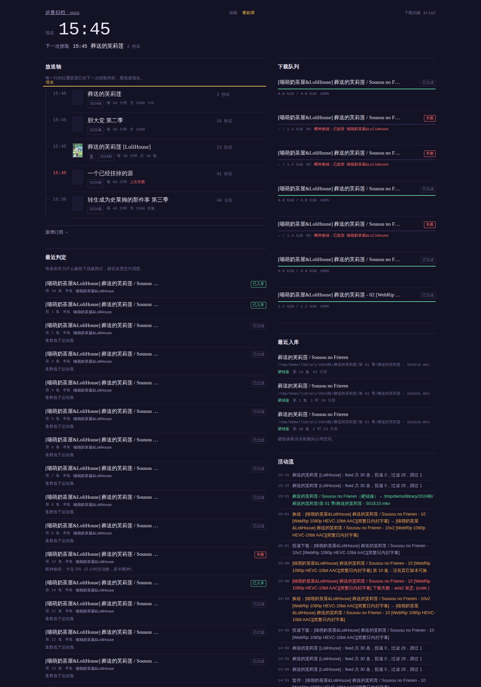
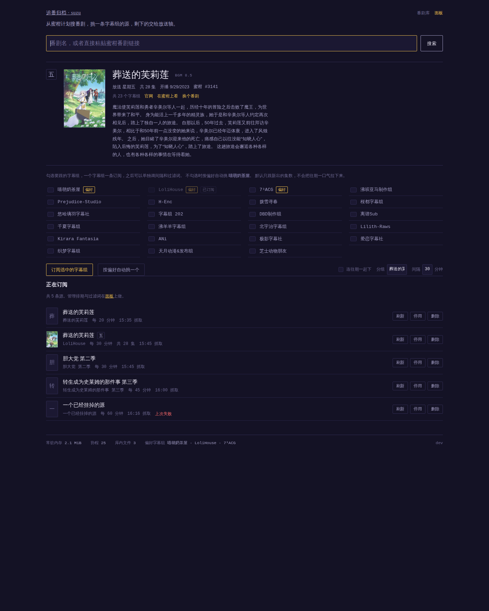

# suzu · 追番归档（IWantWatchAnime）

给 **玩客云 / N1 / 树莓派 / 任意 armv7 或 arm64 小机器** 用的番剧订阅下载归档器：
订阅 RSS → 按规则挑版本 → 交给 aria2 下载 → 自动重命名并硬链接进媒体库 → Jellyfin/Emby/Kodi 直接扫。

设计取舍只看一件事：**在一台 1GB 内存、四核 A5、eMMC 还不能写的小盒子上，能不能连续跑几个月不出事。**
所以它没有 Node、没有 CGO、没有内置 BT 内核、没有前端构建链 —— 只有一个 15MB 的静态二进制。

> 架构与全部取舍理由见 [ARCHITECTURE.md](ARCHITECTURE.md)。

---

## 已经跑通的部分（实测，不是计划）

| 能力 | 状态 |
| --- | --- |
| 多源订阅、ETag/304 条件请求、每源独立间隔、失败只标记不阻塞 | ✅ |
| 标题解析：季/集/半集（11.5）/合集区间/字幕组/分辨率/编码/中文季数 | ✅ 表驱动单测 |
| 规则：包含、排除、偏好打分、起始集数、同集去重（跨字幕组只留最优） | ✅ |
| 下载：aria2（JSON-RPC）与 qBittorrent 两个适配器，可换；`kind="none"` 只匹配不下载 | ✅ 两个内核都有假服务端端到端测试；qBittorrent 另有**真机**联调（见「开发」一节） |
| 对账：进度落库、暂停/继续/移除、失败原因回填 | ✅ 真机 qBittorrent 上「下完在做种」也会照常入库 |
| 断种自动换链：下不动/失败就改投同集另一个字幕组，有次数上限 | ✅ 4 个场景单测 |
| 入库：命名模板、路径安全化、硬链接/复制/移动、NFO、剩余空间检查 | ✅ 硬链接实测 inode 相同、链接数 2 |
| 元数据迟到不影响媒体库：番剧简介/评分补上后，已入库的 `tvshow.nfo` 就地重写 | ✅ 真机实测，日志「番剧级元数据已对齐」 |
| 面板默认只监听本机；要开到局域网必须先设账号密码，否则拒绝启动 | ✅ 实测退出码 2 + 有密码可起 |
| 海报只写本地文件：蜜柑封面与 Bangumi 封面共用 `data/covers/` 一个封面槽，`tvshow.nfo` 里的 `<thumb>` 一定有对应文件 | ✅ 单测 + 真机全链路（真封面 216,601 字节） |
| 面板：放送轴（时间轴 + “现在”光标）、下载队列、最近判定、最近入库、活动流 | ✅ 截图见下 |
| 番剧库（蜜柑刮削）：搜番剧 → 看放送日/集数/封面 → 挑字幕组 → 一键订阅 | ✅ 真机实测，见「番剧库」一节 |
| 封面：抓一次落 `data/covers/`，面板缩略图与媒体库 `poster.jpg` 共用 | ✅ 真实 65,621 字节 JPEG |
| 通知：webhook / Telegram 出口，带节流 | ✅ 真收包 + 请求形状 + 节流 8 个单测 |
| 简介与评分：走 Bangumi 接口补进番剧库与 `tvshow.nfo` | ✅ 真机实测（匿名可用，0.31s） |
| armv7 / armv6 / arm64 / amd64 交叉编译 | ✅ `ELF 32-bit ARM, statically linked`，`ldd` 无输出 |





---

## 番剧库：不用自己找 RSS

以前的流程是"自己去蜜柑翻字幕组、复制 RSS 粘进配置"。现在在面板里点几下就行：

1. **搜**：`/subscribe` 输入「葬送的芙莉莲」→ 两张番剧卡（第一季 / 第二季）。
2. **看**：点进去是这一部的详情——放送日、开播日期、封面、共几个字幕组，
   偏好字幕组带 `偏好` 标签，已经订过的带 `已订阅` 标签。
3. **订**：勾一个字幕组（或点「按偏好自动挑一个」），提交。
   每个字幕组生成一条独立订阅，之后能在面板里单独调间隔、改过滤词、停用、删除。

两个默认值值得先说清楚：

- **默认只跟新的**：点一下订阅不会把整部番的 50GB 往期全拉下来。
  首次轮询会把起点定在"最新一集"，往后只收新出的；想看往期就勾上「连往期一起下」。
- **合集不会伪装成第一集**：像 `[01-28 修正合集]` 这种整季包会解析成 `1-28` 区间，
  因此会被"只跟新的"直接挡掉（理由写在「最近判定」里），而不是当成第 1 集下载。

> 详情页第一次打开要等几秒（蜜柑的单页有 300KB~1MB，看字幕组数量），抓完缓存 12 小时；
> 面板和媒体库用的封面也是这一次抓下来的一张。
>
> 搜索一返回，程序就会在后台把最前面两部番剧的详情抓下来（只在缓存过期时才抓，
> 串行、有节流）——你搜完再点第一张卡，通常已经是"打开就有"而不是干等十秒。

---

## 断种自动换链

老番最烦的不是找不到资源，是**找到了却没人做种**：任务永远停在 0%，不报错也不完成，
面板上只有一条"下载中"，放着过夜还是 0%。这一条给的就是出路：

| 触发 | 动作 |
| --- | --- |
| 下载器明确报错 | 找同一集**被择优刷掉的另一个字幕组版本**，改投它 |
| 卡在 0% 超过 `stuck_hours`（默认 6 小时） | 同上，并把原任务暂停、原因写进面板 |

几条边界，都是刻意的：

- **只在同一订阅的同一集里换**，绝不去别的番剧里找（换错片比不换更糟）。
- **每集最多换 `max_per_episode` 次**（默认 2）。候选池就是 RSS 里已有的条目，
  换链次数记在数据库里（`断种换链` 标记），所以重启也不会重新开始刷。
- **卡住看的是"进度最后一次变化"而不是"最后一次对账"**：对账每 15 秒都会刷新任务的
  更新时间，拿它比会永远算成"刚刚动过"，永远触发不了。因此任务表里单独记了
  `progress_at`，老库升级时会用创建时间回填。
- 换链会发通知、写活动流（暖色标记），并同时留下原条目的失败原因与 `断种换链：已改投 X`
  的任务说明——面板上能一眼看出"这条不是我手动停的，是它自己换了源"。

---

## 快速开始

### 1. 在电脑上交叉编译（推荐，不要在玩客云上编）

```bash
git clone https://github.com/YoisakiKnd/IWantWatchAnime && cd IWantWatchAnime
make armv7          # 产出 bin/suzu-linux-armv7，约 15MB，纯静态
```

产物是**静态无依赖**的 32 位 ARM 可执行文件，目标机不需要装 Go、不需要任何运行库：

```bash
$ readelf -h bin/suzu-linux-armv7 | grep -E 'Class|Machine'
  Class:   ELF32
  Machine: ARM
$ ldd bin/suzu-linux-armv7
  not a dynamic executable
```

### 2. 准备 aria2（下载这件事外包给它）

```bash
apt install aria2
aria2c --enable-rpc --rpc-listen-all=false --dir=/mnt/usb/downloads \
       --max-concurrent-downloads=3 --max-peers=30 --seed-time=0 \
       --continue=true --bt-max-peers=30
```

armv7 上 `--max-peers` 别超过 30，这是 CPU 的主要旋钮。

### 3. 部署到玩客云

```bash
# 开发机上
make armv7
scp -r bin/suzu-linux-armv7 deploy root@玩客云:/root/setup/

# 盒子上（先把外接盘按 UUID 挂到 /mnt/usb）
sudo SUZU_DATA=/mnt/usb /root/setup/deploy/install.sh
```

一条命令装完：建目录、拷二进制、按 `deploy/config.armv7.toml` 渲染出 `config.toml`（随机生成面板密码并打印）、
建 `suzu` 系统用户、装 `deploy/suzu.service` 并起服务，最后等 `/healthz` 起来才算完。
脚本会**拒绝在"不是挂载点的目录"上安装**——防的就是"盘没挂上，数据全写进 eMMC"。

逐步的手工步骤、aria2 的 unit、五个核对项、排错表都在 **[deploy/README-armv7.md](deploy/README-armv7.md)**。

`deploy/suzu.service` 里已经把 eMMC 保护写好了：`ProtectSystem=strict` + 只有 `data/ downloads/ library/` 三个目录可写，
另外 `MemoryMax=192M` / `CPUWeight=20` 保证它失控时也抢不走 SSH 的 CPU 与内存。
启动时会 Ping 一次下载内核（对 aria2 只是一个 `getVersion`），探不到就退出、由 `Restart=always` 每 5 秒重试——
所以 aria2 晚起没关系，但 unit 名字写错会让你看到一个每 5 秒重启的服务。

### 4. 本机随便跑跑

```bash
go run ./cmd/suzu -config config.example.toml -log-level debug
# 打开 http://127.0.0.1:8637
```

---

## 配置要点

完整注释见 [config.example.toml](config.example.toml)。最关键的几项：

```toml
[engine.aria2]
endpoint = "http://127.0.0.1:6800/jsonrpc"
dir      = "/mnt/usb/downloads"

[library]
root      = "/mnt/usb/library"          # 指给 Jellyfin/Emby/Kodi 扫
name_rule = "{group}/{title}/第 {season:02d} 季/{title} - S{season:02d}E{span}"
link_mode = "hardlink"                  # 不占第二份空间；exFAT/NTFS 会自动降级为复制

[runtime]
mem_limit_mib = 64                      # GOMEMLIMIT，1GB 的机器给 48~96 稳
poll_workers  = 2                       # 会自动夹到 4

[[feeds]]
name = "葬送的芙莉莲"
url  = "https://mikanani.me/RSS/Bangumi?bangumiId=2996&subgroupid=12"
group = "2024秋"
interval_min = 30
include = ["1080", "简"]
exclude = ["招募", "720"]
prefer  = ["喵萌奶茶屋", "LoliHouse"]
```

```toml
[metadata]
enabled      = true                  # 关掉也能用：只是没有番剧库，全靠手写 feeds
provider     = "mikan"
prefer       = ["喵萌奶茶屋", "LoliHouse", "7³ACG"]   # 一键订阅时的自动挑选顺序
cache_hours  = 12                    # 番剧详情缓存时长
fetch_poster = true                  # 封面写进媒体库 poster.jpg
bgm_base     = ""                    # 留空 = 官方 api.bgm.tv；可换镜像或自建
bgm_token    = ""                    # 留空也能用：匿名额度够刮简介与评分

[relink]
enabled         = true               # 断种自动换链
stuck_hours     = 6                  # 卡在 0% 多久算断种（夹到 1~72）
max_per_episode = 2                  # 同一集最多换几次（夹到 1~5）
```

> `name_rule` 里的 `{span}` = **集数或合集区间**：单集是 `03`，合集是 `01-28`。
> 别用 `{episode}` 给合集命名，那样合集会和真正的第一集同名（`S01E01`）。

> ⚠️ **硬链接的前提**：下载目录与媒体库必须在**同一个文件系统**（都用外接盘）。
> 跨盘时程序会自动退化成复制，并在日志里说明原因。

---

## 面板

单页，三个轮询片段自动刷新（队列 5s / 活动流 8s / 判定 15s / 库 30s），无前端构建、无 npm。

- **放送轴**：每行的纵向位置就是它下一次抓取的时刻，黄线是“现在”。重启后 45 秒内会把所有源摊开跑一遍。
- **最近判定**：每条发布为什么被收下或被跳过（`命中排除条件：招募` / `同集已有更优版本（喵萌奶茶屋）`）——无人值守时这是最有用的信息。
- **活动流**：不需要 SSH 就能看到“刚才发生了什么”。

接口：`GET /api/v1/state`（JSON，带 `X-Api-Token` 或 Basic Auth）、`GET /healthz`（免认证，给 systemd/uptime 探活）。

---

## 开发

```bash
make test            # 全部单测 + 端到端（本地假 RSS + 假 aria2，不联网）
make bench           # 标题解析基准：确认弱 CPU 是否吃得消
make all             # amd64 + armv7 + arm64 一起出
make size            # 看体积
```

三组"对着外部世界"的联调默认跳过，要用的时候显式打开（它们要真网络 / 真下载器）：

```bash
MIKAN_LIVE=1 go test ./internal/mikan/    -run TestLiveSmoke     -v   # 真抓蜜柑搜索与详情
BGM_LIVE=1   go test ./internal/metadata/ -run TestLiveSmokeBGM  -v   # 真打 api.bgm.tv
MIKAN_LIVE=1 BGM_LIVE=1 go test ./internal/pipeline/ -run TestLiveCover -v  # 真封面+简介 → 媒体库 NFO
qbittorrent-nox --profile=/tmp/qbt --webui-port=8080                  # 起一台真下载器
QBT_LIVE=1 QBT_PASS=<日志里的临时密码> go test ./internal/downloader/ -run TestQBitLive -v
```

最后一条是真机联调里最值钱的：它投递一个真 `.torrent`，把认领回来的 infohash 与
种子 info 字典的 sha1 逐字节比对，再走一遍状态读取、暂停/继续、磁力链、删除。
（写这个用例时它当场抓出一个真 bug：qBittorrent 下完会停在 `seeding`，
对账只认 `completed`，于是这一集永远不会入库。）

测试里最有价值的一条：`internal/httpx/templates_test.go` 会把首页和所有片段真正渲染一遍。
模板是运行期求值的，函数名写错编译期发现不了 —— 这个测试写出来当场抓到两个真 bug。

---

## 不会做的事（明确划界）

- ❌ 不做内置 BT 内核：DHT/tracker/加密握手放在 aria2 里，suzu 崩了下载还在继续，aria2 崩了面板照样能看排期。
- ❌ 不做内置数据库服务：SQLite 单文件 + WAL，备份就是拷一个文件。
- ❌ 不做好友/追番社区/弹幕：这是下载归档器，不是 Bangumi 的替代品。
- ❌ 不做「冰冰冰」和「灵动岛」：本期明确不要花哨动效。

## License

MIT